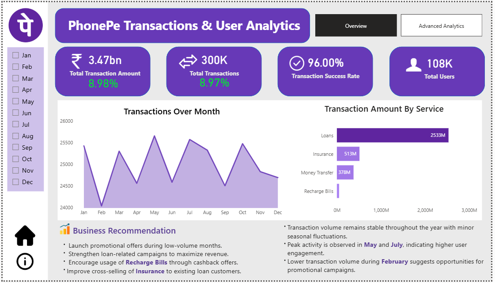
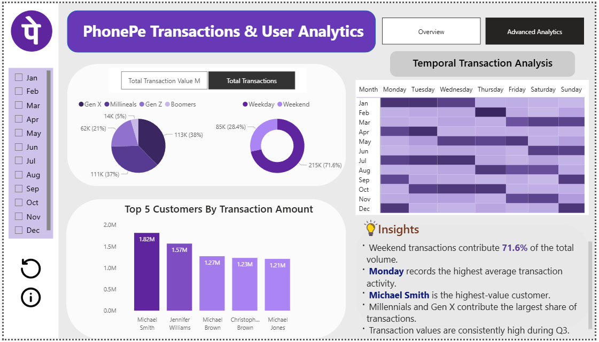

# 📱 PhonePe Transactions & User Analytics Dashboard

### 🚀 End-to-End Business Intelligence Project using Power BI


---

# 📌 Project Overview

The **PhonePe Transactions & User Analytics Dashboard** is an interactive Business Intelligence solution developed using **Power BI**. The dashboard transforms raw transaction data into meaningful insights, enabling businesses to monitor transaction performance, understand customer behavior, and make data-driven decisions.

This project demonstrates the complete BI workflow, including **data cleaning, data modeling, DAX calculations, KPI development, dashboard design, and business storytelling**.

---

# 🎯 Business Objectives

- Monitor overall transaction performance.
- Analyze monthly transaction trends.
- Identify top-performing services.
- Understand customer segmentation.
- Compare weekday and weekend transaction behavior.
- Generate actionable business insights and recommendations.

---

# 🛠️ Tech Stack

- **Power BI Desktop**
- **Power Query**
- **DAX (Data Analysis Expressions)**
- **Microsoft Excel**
- **Data Modeling**
- **Interactive Dashboard Design**

---

# 📊 Dashboard Features

## 📄 Overview Dashboard

The Overview page provides a high-level summary of business performance.

### Features

- Total Transaction Amount KPI
- Total Transactions KPI
- Transaction Success Rate
- Total Users
- Monthly Transaction Trend
- Transaction Amount by Service
- Interactive Month Filter
- Business Recommendations
- Business Insights

### Dashboard Preview



---

## 📄 Advanced Analytics Dashboard

The Advanced Analytics page focuses on customer behavior and detailed transaction analysis.

### Features

- Customer Segmentation
- Generation-wise User Distribution
- Weekday vs Weekend Analysis
- Temporal Transaction Heatmap
- Top 5 Customers
- Interactive Insights
- Month-wise Filtering

### Dashboard Preview



---

# 📈 Key KPIs

| KPI | Description |
|------|-------------|
| 💰 Total Transaction Amount | Total value of all successful transactions |
| 🔄 Total Transactions | Overall number of completed transactions |
| ✅ Transaction Success Rate | Percentage of successful transactions |
| 👥 Total Users | Number of unique users |
| 📈 Monthly Trend | Monthly transaction growth analysis |
| 📅 Weekend Analysis | Weekday vs Weekend transaction comparison |

---

# 🔍 Key Business Insights

- Loan services contribute the highest transaction value.
- Transaction volume remains consistent throughout the year with seasonal fluctuations.
- Peak transaction activity occurs during **May** and **July**.
- Weekend transactions account for a significant portion of total transaction volume.
- Millennials and Gen X represent the largest customer segments.
- February records comparatively lower transaction activity, highlighting opportunities for promotional campaigns.

---

# 💡 Business Recommendations

- Launch promotional campaigns during low-volume months.
- Strengthen marketing efforts for loan-related services.
- Increase Recharge Bills usage through cashback offers.
- Cross-sell Insurance products to existing customers.
- Focus marketing campaigns around high-performing periods.

---

# 📂 Repository Structure

```text
Phonepe_Transaction_And_User_Analytics_Powerbi_Project
│
├── README.md
├── PhonePe_Transactions_Dashboard.pbix
├── Phonepe Powerbi project.pdf
├── Overview.png
├── Advanced_analysis.png
└── Dataset.xlsx
```

---

# 🧮 Power BI Skills Demonstrated

- Data Cleaning
- Data Transformation
- Data Modeling
- Star Schema Design
- DAX Measures
- KPI Development
- Dashboard Design
- Interactive Navigation
- Bookmarks & Buttons
- Slicers
- Business Intelligence
- Data Storytelling

---

# 🚀 Future Improvements

- Publish the dashboard to Power BI Service.
- Implement Row-Level Security (RLS).
- Enable real-time data refresh.
- Add predictive analytics for transaction forecasting.
- Develop a mobile-optimized dashboard layout.

---

# 📄 Project Report

A detailed PDF report containing the complete dashboard is available below.

📥 **Download the Project Report**

➡️ **[PhonePe Power BI Project Report](Phonepe%20Powerbi%20project.pdf)**

---

# 📬 Contact

**Yadnyavalk Deshmukh**

**Data Analyst | Power BI | SQL | Python | Excel**

📧 Email: **deshmukhyadnyavalk@gmail.com**

🔗 LinkedIn: **https://www.linkedin.com/in/yadnyavalk**

💻 GitHub: **https://github.com/Yadnyavalk**

---

# ⭐ Support

If you found this project helpful or interesting, please consider **starring ⭐ this repository**.

It motivates me to continue building and sharing more Data Analytics and Business Intelligence projects.

Thank you for visiting my GitHub repository! 🚀
